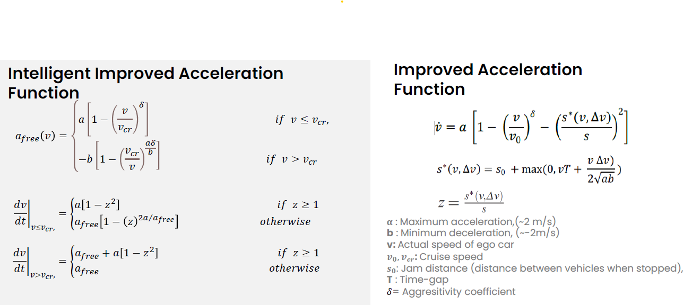
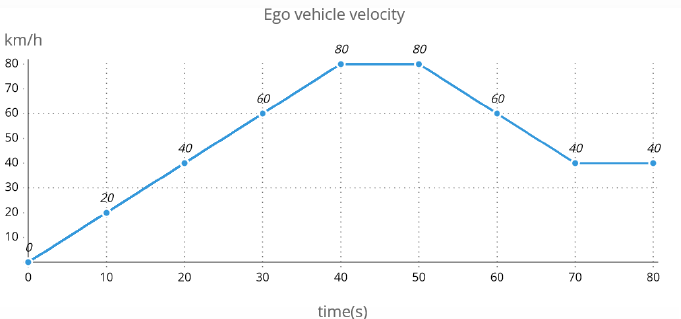
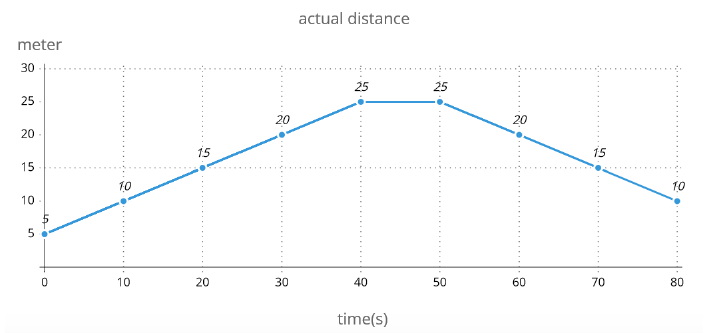

# Intelligent Improved Acceleration Function Simulink Model

This project implements the "Intelligent Improved Acceleration Function" using MATLAB/Simulink. The simulation runs for 80 seconds and outputs various graphs including velocity and acceleration demand.

## Objective
The main objective is to simulate the given acceleration function method for 80 seconds using MATLAB/Simulink and to visualize the results as per the provided requirements.

## Mathematical Model
The acceleration function is defined as follows:

### Free Acceleration Function:


These formulas govern the behavior of the acceleration and velocity dynamics for the simulation.

## Simulation Parameters
The following parameters are used in the simulation:
- Cruise speed: Vcr = 100 km/h
- 𝛿 = 2,
- a = 2, \ b = 2
- T = 1.5s
- s0 = 2m

## Prerequisites
- MATLAB R2021b or later.
- Simulink Toolbox installed.

## Setup Instructions
1. Clone the repository:
    ```bash
    git clone <repository_url>
    ```
2. Open MATLAB and navigate to the project folder.
3. Open the Simulink model file `IntelligentAccelerationModel.slx`.
4. Run the simulation for 80 seconds.
5. Ensure the input signals (ego vehicle speed and distance) are configured correctly using Signal Builder blocks.

## Input Signals
1. **Ego vehicle velocity (`v`)**: Defined as per the bottom graph in the provided assignment document.
    
3. **Distance between vehicles (`z`)**: Defined as per the top graph in the provided assignment document.
    

## Outputs
The simulation generates the following outputs:
1. Velocity profile over time.
2. Acceleration demand profile over time.

## Results
Graphs showcasing the velocity and acceleration demands are stored in the `results` folder as `.pdf` files. Example screenshots are provided below:
- Velocity Profile
- Acceleration Demand

## Notes
- Ensure all units are consistent with the MKS (meter-kilogram-second) system.
  
---

